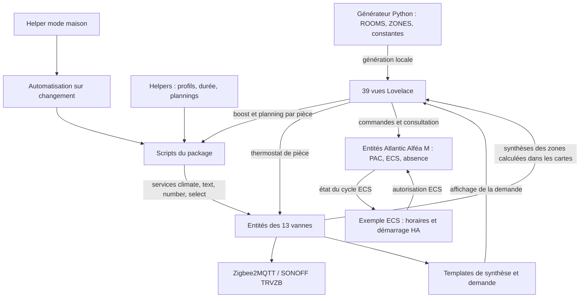

# Architecture actuelle de Heat Manager

Cartographie statique du 20 septembre 2026, établie sur le sous-dépôt `ha-heat-manager`, révision `981ef44`. Elle décrit les déclarations présentes dans les fichiers, sans validation du fonctionnement sur Home Assistant.

Les deux documents demandés étaient absents lors de la première lecture ; ils ont été créés dans `ha-heat-manager/docs/`, à la demande confirmée de l’utilisateur. Initialement absent, `AGENTS.md` est maintenant disponible et a été lu lors de la reprise. Les copies de fichiers situées dans les dossiers homonymes du répertoire parent ne constituent pas la source de cette cartographie ; leur synchronisation et leur déploiement ne sont pas établis.

## Contexte déclaré dans AGENTS.md

L’installation décrite utilise Home Assistant OS dans une VM sur un NAS Synology DS218+, Zigbee2MQTT, Mosquitto et un coordinateur SLZB-06 en TCP/IP. Le chauffage repose sur une PAC Atlantic Alféa M Duo R290 triphasée, des radiateurs à eau et un thermostat Navilink 228 situé dans le salon, avec régulation Smart Adapt et consigne centrale habituelle proche de 19 °C. Tous les radiateurs ne disposent pas nécessairement d’une vanne connectée. L’interface cible est un téléphone en portrait.

Ces informations proviennent des consignes du projet et ne sont pas des observations d’une installation active. Les contrôles et overrides de groupes cités parmi les fonctionnalités attendues dans `AGENTS.md` ne prouvent pas leur implémentation : la cartographie ci-dessous décrit les commandes de pièce, le mode maison et les zones de synthèse effectivement déclarés dans les sources.

Les consignes imposent une lecture ciblée, la préservation des identifiants et des changements minimaux. Cette phase reste limitée à la documentation, sans audit fonctionnel ni modification de configuration.

## 1. Organisation du dépôt

| Fichier | Responsabilité | Nature |
|---|---|---|
| `packages/heat_manager_trvzb.yaml` | Helpers, synthèses, demande de chauffage, scripts des vannes et réaction au mode maison | Configuration Home Assistant écrite directement |
| `tools/generate_heat_manager_dashboard.py` | Inventaire des pièces, zones, entités PAC/ECS, construction et sérialisation des vues | Source du tableau de bord |
| `lovelace/heat_manager_mobile_views.yaml` | Ensemble de 39 vues à fusionner dans `lovelace-mobile` | Artefact généré, versionné |
| `examples/ecs_hours_offpeak_automation.yaml` | Autorisation ECS selon les heures creuses | Automatisation optionnelle à installer séparément |
| `README.md` | Présentation, dépendances et installation manuelle | Documentation |

Chacun des quatre dossiers prioritaires contient un seul fichier dans le dépôt observé. Il ne contient ni intégration Home Assistant personnalisée, ni définition des équipements Zigbee, ni suite de tests ou chaîne CI versionnée.

## 2. Composants et flux

Le package pilote les vannes par les services Home Assistant ; il ne publie pas directement sur MQTT. Les entités nécessaires sont fournies par l’installation. Les commandes PAC, ECS et absence du tableau de bord utilisent directement les entités Alféa M, sans passer par les scripts TRVZB.

Le capteur de demande des vannes est consommé par l’interface. Aucune automatisation de ce dépôt ne le relie à une commande de la PAC. L’absence PAC et le profil « Absence » des vannes sont deux chemins distincts, sans synchronisation définie ici.

## 3. Package TRVZB

Le fichier porte l’en-tête `v2.1.0-beta.2`. Ses domaines racine sont `input_number`, `input_select`, `input_text`, `template`, `script` et `automation`.

### État conservé dans les helpers

| Domaine | Nombre | Rôle |
|---|---:|---|
| `input_number` | 4 | Profils absence, nuit, confort et durée du boost |
| `input_select` | 1 | `chauffage_mode_maison` : Auto, Confort, Nuit, Absence, Arrêt |
| `input_text` | 39 | Trois plannings par pièce : semaine, samedi, dimanche |

Les valeurs de référence sont commentées ; aucun `initial:` actif n’est déclaré. La restauration des états est confiée à Home Assistant. Les plannings sont des chaînes stockées dans les helpers puis transmises explicitement aux entités `text` des vannes.

### Capteurs calculés

Le bloc `template` déclare dix capteurs de synthèse : maison, chambres inoccupées, chambre Mathias, SDB garçons, SDB Julie, chambre parents, dressing, SDB parents, sous-sol et buanderie. Ils lisent températures, modes, activité et batteries ; leurs regroupements ne correspondent pas exactement aux quatre zones de navigation.

Le capteur binaire de demande a pour `unique_id` `chauffage_demande_chauffage`. Son expression compte les vannes en `auto` ou `heat` dont la consigne dépasse la mesure de plus de 0,5 °C, avec un `delay_on` de quinze minutes. Ses attributs exposent les nombres de pièces en demande et en forte demande (écart supérieur à 1 °C), l’écart maximum, la pièce correspondante et la liste des pièces en demande. Le tableau de bord le référence comme `binary_sensor.chauffage_demande_chauffage` ; le registre réel d’entités n’a pas été consulté.

### Points d’entrée de commande

| Script | Exécution | Entrées et services utilisés |
|---|---|---|
| `chauffage_appliquer_planning_cible` | `queued` | `cible` → correspondance pièce/vanne/slug → trois helpers → contrôle de format → sept `text.set_value` → `climate.set_hvac_mode` en Auto |
| `chauffage_boost_cible` | `queued` | `cible` et helper de durée → `number.set_value` sur la durée temporaire → `select.select_option` avec `boost` |
| `chauffage_mode_maison_appliquer` | `restart` | Lecture du mode maison et des profils → commandes collectives des treize vannes |

Le script planning contient une expression régulière pour six changements `HH:MM/température`, entre 4 et 35 °C par pas de 0,5 °C. La semaine est copiée du lundi au vendredi, puis samedi et dimanche séparément. Cette description ne vaut pas validation exhaustive du format ou du comportement des appareils.

Pour le mode maison, la branche Auto envoie `auto` ; Arrêt envoie une durée temporaire nulle, une consigne de 7 °C puis `off` ; les profils Confort, Nuit et Absence passent par `climate.set_temperature` avec `hvac_mode: heat`.

L’unique automatisation du package, `chauffage_mode_maison_sur_changement`, appelle ce dernier script lors d’une transition entre deux modes valides distincts. Aucun déclencheur de démarrage ou de retour de disponibilité n’y figure.

## 4. Pièces, zones et conventions d’entités

Les zones sont définies dans `ZONES` et les pièces dans `ROOMS` du générateur. Le package possède ses propres listes et dictionnaires de correspondance : il n’est pas généré à partir de `ROOMS`.

| Zone d’interface | Clé de pièce / cible | Base des entités de vanne | Slug du planning |
|---|---|---|---|
| Parents | `chambre_parents` | `radiateur_parents` | `chambre_parents` |
| Parents | `dressing` | `radiateur_dressing` | `dressing` |
| Parents | `sdb_parents` | `radiateur_sdb_parents` | `sdb_parents` |
| 1er étage | `chambre_julie` | `radiateur_chambre_julie` | `chambre_julie` |
| 1er étage | `chambre_pablo` | `radiateur_chambre_pablo` | `chambre_pablo` |
| 1er étage | `grande_chambre_amis` | `radiateur_grande_chambre_amis` | `grande_chambre_amis` |
| 1er étage | `petite_chambre_amis` | `radiateur_petite_chambre_amis` | `petite_chambre_amis` |
| 1er étage | `chambre_mathias` | `radiateur_chambre_mathias` | `chambre_mathias` |
| 1er étage | `sdb_garcons` | `radiateur_sdb_garcons` | `sdb_mathias` |
| 1er étage | `sdb_julie` | `radiateur_sdb_julie` | `sdb_julie` |
| Buanderie | `buanderie` | `radiateur_buanderie` | `buanderie` |
| Sous-sol | `atelier` | `radiateur_atelier` | `atelier` |
| Sous-sol | `salle_cine` | `radiateur_salle_cine` | `salle_cine` |

Pour chaque base, les interfaces attendues sont `climate.<base>`, `sensor.<base>_battery`, `text.<base>_weekly_schedule_<jour anglais>`, `number.<base>_temporary_mode_duration` et `select.<base>_temporary_mode_select`. Les helpers suivent `input_text.chauffage_planning_<slug>_<semaine|samedi|dimanche>`.

Le slug historique `sdb_mathias` et le `unique_id` de synthèse `chauffage_sdb_mathias_resume` sont conservés pour la SDB garçons. Les zones ne constituent pas des cibles de scripts. Il existe néanmoins un capteur de synthèse du sous-sol dans le package.

## 5. Tableau de bord et génération

Le générateur utilise uniquement la bibliothèque standard Python (`json`, `pathlib`, `typing`). `build_views()` compose les vues ; `dump_yaml()` et `scalar()` assurent la sérialisation ; `main()` écrit le fichier Lovelace sous la racine du dépôt. Il ne contacte pas Home Assistant. Le générateur n’a pas été exécuté lors de cette cartographie.

Les 39 vues déclarées se répartissent en dix vues générales, trois vues de zones à plusieurs pièces, treize vues de pièces et treize vues de planning. Elles utilisent les Sections, une seule colonne, Mushroom et card-mod.

| Groupe | Routes sous `/lovelace-mobile/` |
|---|---|
| Accueil et paramètres | `chauffage-v2`, `chauffage-parametres` |
| PAC | `chauffage-pac`, `chauffage-pac-planning`, `chauffage-pac-technique`, `chauffage-pac-diagnostic` |
| ECS | `chauffage-ecs`, `chauffage-ecs-planning`, `chauffage-ecs-historique` |
| Absence | `chauffage-absence` |
| Zones | `chauffage-zone-parents`, `chauffage-zone-premier-etage`, `chauffage-zone-sous-sol` |
| Pièces et planning | `chauffage-piece-<clé avec tirets>`, `chauffage-planning-piece-<clé avec tirets>` |

La buanderie est accessible directement comme pièce. Les cartes de zones calculent leurs synthèses depuis les entités `climate`. Chaque pièce présente un thermostat, la batterie, le boost et l’accès au planning. Les paramètres exposent les trois profils et la durée du boost. L’état du mode maison apparaît dans la carte globale ; le helper et son automatisation appartiennent au package.

La fonction auxiliaire `mode_chips()` référence `script.chauffage_appliquer_mode_cible`, mais n’est pas appelée par la construction actuelle des vues. Elle doit être distinguée des points d’entrée réellement présents dans l’artefact.

Les constantes du générateur fixent les identifiants PAC/ECS/absence sous `atlantic_alfea_m_duo_*`. Le chauffage utilise notamment le `climate` du circuit 1 et le `number` de consigne générale. Le planning PAC affiche sept capteurs quotidiens, sans commande d’écriture. L’absence utilise un switch et deux entités `datetime`. L’historique ECS s’appuie sur une carte `history-graph` de 72 heures ; son stockage historique relève de l’installation Home Assistant.

## 6. Automatisation ECS séparée

L’exemple déclare quatre horaires (00:54, 07:24, 11:54, 13:24) et un déclencheur au démarrage de Home Assistant. Il active l’autorisation ECS au début des plages, ou au démarrage si une plage est en cours. Dans la branche de désactivation, il attend la fin du cycle actif, au maximum 90 minutes, puis coupe le switch. Son mode est `restart`.

Ses dépendances sont `switch.atlantic_alfea_m_duo_eau_chaude` et `binary_sensor.atlantic_alfea_m_duo_cycle_ecs_capacite_99`. Le tableau de bord attend l’entité `automation.gestion_eau_chaude_alfea_heures_creuses`, définie par la constante `ECS_AUTOMATION`. L’existence de cet identifiant après import n’est pas établie ici.

## 7. Frontière de déploiement

Le README prévoit l’inclusion des packages par `homeassistant.packages`, la copie du package et la fusion manuelle des vues dans le tableau de bord en mode stockage. L’exemple ECS est installé indépendamment. Les prérequis déclarés sont Home Assistant avec Sections, Mushroom, card-mod, Zigbee2MQTT, treize SONOFF TRVZB et le composant Atlantic Alféa M (version minimale annoncée : 0.1.0).

Les intégrations, ressources Lovelace, registre des entités, états restaurés et automatisations réellement actives sont extérieurs à ce dépôt. Cette cartographie ne confirme ni leur présence ni leur configuration. Le cadrage de la suite est consigné dans [AUDIT_HEAT_MANAGER.md](AUDIT_HEAT_MANAGER.md).
